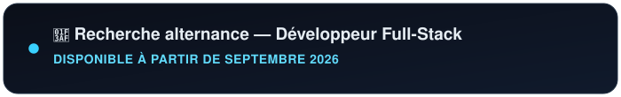

 

  

 

### Profil

Développeur full-stack en devenir, je construis régulièrement des projets personnels afin de consolider mes compétences en front-end et back-end. Motivé par l'apprentissage continu, je recherche une opportunité me permettant de progresser dans un environnement technique stimulant.

### 🎯 En ce moment

- 💼 Développement backend chez **Hermès** — NestJS, TypeScript, migration de schémas de validation vers Zod
- ⚔️ Construction de **chaos_mode**, mon premier mod Minecraft — première fois en Java
- 📚 Progression sur mes certifications CS50 / freeCodeCamp

### 💼 Expérience professionnelle

**Stagiaire Assistant Software Engineer — Hermès, Paris** `avr. 2026 – aujourd'hui`
Développement de fonctionnalités backend en Node.js / TypeScript · maintenance, refactoring et optimisation d'applications existantes · mise en place de tests unitaires, fonctionnels et d'intégration · participation aux code reviews et aux rituels Agile.

### 💪 Avant le code

Animateur sportif (Ville de Bobigny) et manœuvre bâtiment — deux expériences terrain qui m'ont appris la rigueur, le travail en autonomie et la gestion d'équipe. Le détail est sur mon [CV](./CV_Rafael_Antunes_oliveira.pdf).

### 🚀 Projets personnels

<table>
<tr>
<td width="50%" valign="top">

**🌐 Portfolio — `rafatns.vercel.app`**
Vite + React + Tailwind + Framer Motion. Identité bleu nuit/cyan, rose bleue SVG animée, multilingue FR/EN/PT/ES, dark/light mode.

</td>
<td width="50%" valign="top">

**🃏 Poker Texas Hold'em — multijoueur temps réel**
React / Firebase / Tailwind. Phases de jeu complètes, salles avec ID partageable, évaluation auto des mains, chat intégré, sync Firebase Realtime Database.
[repo](https://github.com/alnrfLO/poker) · [démo](https://poker-murex-seven.vercel.app)

</td>
</tr>
<tr>
<td width="50%" valign="top">

**🌙 Yofukashi no Uta — wiki interactif**
React / TypeScript / Vite, pour apprendre TypeScript en conditions réelles. Wiki non-officiel de l'anime *Call of the Night*, animation d'étoiles en Canvas API, navigation multi-pages.
[repo](https://github.com/alnrfLO/yofukashi-no-uta)

</td>
<td width="50%" valign="top">

**⚔️ chaos_mode — mod Minecraft**
Java / Fabric, premier projet en Java. Items custom, ToolMaterial dédié, pipeline d'assets, objectif : bloc `CHAOS_CORE`.

</td>
</tr>
</table>

### 🛠️ Compétences

 

📌 Snapshot pris le 28 juillet 2026 — dis-moi quand tu veux que je régénère avec des chiffres à jour.

### 📡 Contact

 

### 🐍 Contributions

⚠️ S'anime une fois le workflow `snake.yml` actif dans `.github/workflows/` de ton repo (fourni séparément) — génère automatiquement l'image chaque nuit à partir de ton propre historique GitHub, donc pas de dépendance à un service tiers.

 

