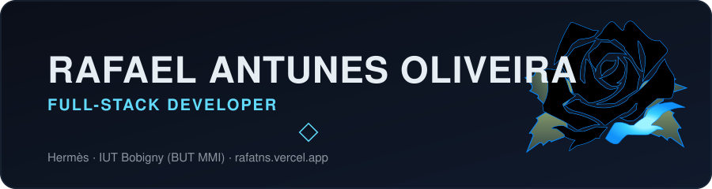

 

### Profil

Développeur full-stack en devenir, je construis régulièrement des projets personnels afin de consolider mes compétences en front-end et back-end. Motivé par l'apprentissage continu, je recherche une opportunité me permettant de progresser dans un environnement technique stimulant.

### 💼 Expériences professionnelles

**Stagiaire Assistant Software Engineer — Hermès, Paris** `avr. 2026 – aujourd'hui`
Développement de fonctionnalités backend en Node.js / TypeScript · maintenance, refactoring et optimisation d'applications existantes · mise en place de tests unitaires, fonctionnels et d'intégration · participation aux code reviews et aux rituels Agile.

**Animateur sportif — Ville de Bobigny** `juil. 2024 – août 2024`
Animation d'activités sportives pour enfants et adultes (Bobigny Plage – JO) · encadrement de groupes · organisation logistique et gestion du matériel.

**Manœuvre bâtiment (finition intérieure) — Indépendant, Drancy** `janv. 2023 – janv. 2024`
Peinture et pose de cloisons placo · préparation des surfaces et finitions · travail en autonomie sur chantier.

### 🚀 Projets personnels

<table>
<tr>
<td width="50%" valign="top">

**🌐 Portfolio — `rafatns.vercel.app`**
Vite + React + Tailwind + Framer Motion. Identité bleu nuit/cyan, rose bleue SVG animée, multilingue FR/EN/PT/ES, dark/light mode.

</td>
<td width="50%" valign="top">

**🃏 Poker Texas Hold'em — multijoueur temps réel**
React / Firebase / Tailwind. Phases de jeu complètes, salles avec ID partageable, évaluation auto des mains, chat intégré, sync Firebase Realtime Database.
[repo](https://github.com/alnrfLO/poker) · [démo](https://poker-murex-seven.vercel.app)

</td>
</tr>
<tr>
<td width="50%" valign="top">

**🌙 Yofukashi no Uta — wiki interactif**
React / TypeScript / Vite, pour apprendre TypeScript en conditions réelles. Wiki non-officiel de l'anime *Call of the Night*, animation d'étoiles en Canvas API, navigation multi-pages.
[repo](https://github.com/alnrfLO/yofukashi-no-uta)

</td>
<td width="50%" valign="top">

**⚔️ chaos_mode — mod Minecraft**
Java / Fabric, premier projet en Java. Items custom, ToolMaterial dédié, pipeline d'assets, objectif : bloc `CHAOS_CORE`.

</td>
</tr>
</table>

### 🛠️ Compétences

 

### 🌍 Langues

Français (natif) · Anglais C1 · Espagnol C1 · Portugais C2 · Japonais A1 · Italien A1

### 🎯 Centres d'intérêt

⚽ Football (FC Porto) · 🥋 Karaté (instructeur fédéral DIF) · ✈️ Voyager · 📖 Lecture · 🍳 Cuisiner · 🎮 Gaming & anime

### 📡 Contact

 

### 🐍 Contributions

 

